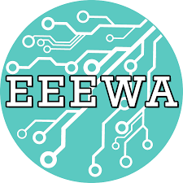

<!-- EEEWA GitHub Organization README -->

# EEEWA

Welcome to the official GitHub organization of EEEWA (Electrical and Electronic Engineers Without Borders Association)!

## About Us

EEEWA is a non-profit organization that brings together electrical and electronic engineers, students, and enthusiasts to collaborate on innovative projects for social impact. We believe in leveraging engineering skills to address global challenges and improve lives.

## Our Projects

### Project Phoenix

Project Phoenix is our flagship project aimed at developing a high-performance, compact, and versatile RC car with advanced control systems and long-range RF communication. This project pushes the boundaries of RC car technology and serves as a platform for learning, experimentation, and innovation.

- [Phoenix Repository](https://github.com/EEEWA-Club/Phoenix)
- [Phoenix-Control Repository](https://github.com/EEEWA-Club/Phoenix-Control)
- [Phoenix-RF Repository](https://github.com/EEEWA-Club/Phoenix-RF)
- [Phoenix-Modules Repository](https://github.com/EEEWA-Club/Phoenix-Modules)

### Other Projects

We have a diverse range of projects spanning various domains, including renewable energy, robotics, healthcare, and more. Explore our repositories to discover the exciting initiatives undertaken by our talented community.

## Get Involved

If you share our passion for engineering and social impact, we invite you to join our community and contribute to our projects. Whether you're an experienced professional or a beginner, there are opportunities for collaboration and learning.

- Join our [Discord Server](https://discord.gg/eeewa) to connect with fellow members, ask questions, and get involved.
- Visit our [Website](https://www.eeewa.org) to learn more about EEEWA and explore ways to participate.

Let's make a difference together through engineering innovation!

